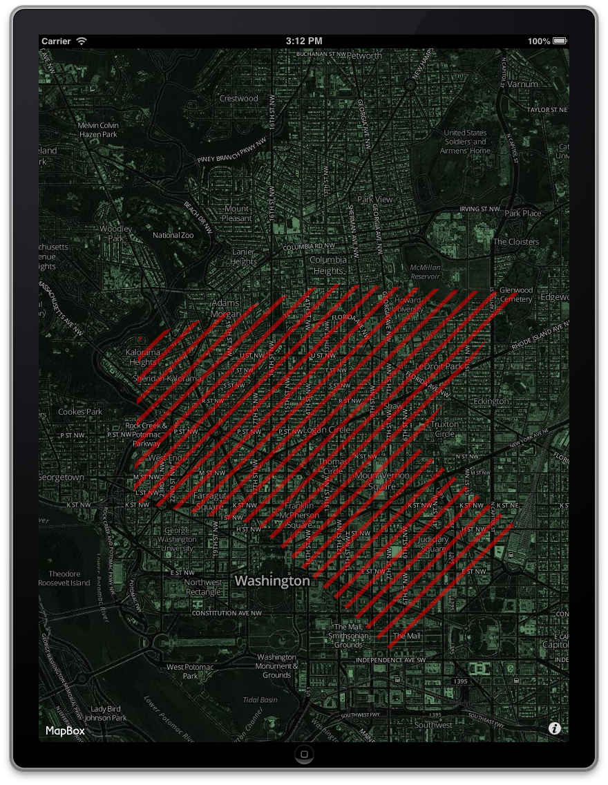

A quick demo showing how to make a custom-colored hatching pattern in vector shapes with the MapBox iOS SDK. All processing done client-side and on-the-fly. 

Requires [CocoaPods](http://cocoapods.org) for installation of the SDK. See the [installation guide](http://mapbox.com/mapbox-ios-sdk/) for more details. 

